# My SOC Analyst Home Lab
This project was completed following Eric Capuano's blog series, "So You Want to Be a SOC Analyst?" & Gerald Auger's (Simply Cyber YouTube) video, "Uncover the Secrets of a Home SOC Analyst Lab!". It involved hands-on experience in setting up, running, and analyzing security tools and processes fundamental to the role of a SOC Analyst, providing practical skills in threat detection, incident response, and proactive cybersecurity operations.

As I began building my cybersecurity knowledge, extensive research led me to Eric Capuano's highly recommended project, "[So You Want to Be a SOC Analyst?](https://blog.ecapuano.com/p/so-you-want-to-be-a-soc-analyst-intro)", renowned for its practical, hands-on approach to learning essential security operations skills. I used Gerald Auger's (Simply Cyber YouTube) video, "[Uncover the Secrets of a Home SOC Analyst Lab!](https://www.youtube.com/watch?v=oOzihldLz7U)" to help guide me.

As I started to do this project, I realized that it wasn't just about understanding the defensive side of security but also the offensive side of security.

Here is what I have learned from the project:
* Setting up virtual environments on the VMWare Workstation
* Deploying an Linux VM (Ubuntu Live Server) and a Windows VM
* Configuring the Windows security settings via Registry, Safe Mode, and PowerShell
* Using Command Prompt, PowerShell, and Linux CLI's
* Using SSH to access the Linux shell from a personal computer
* Setting up a C2 (Command and Control) server on the Ubuntu Server using Sliver
* Dropping the C2 payload on the Windows VM
* Analyzing the telemetry and EDR using LimaCharlie to detect the Sliver attack and defend against it

## Setting up:

I set up a Windows VM (victim) and Linux VM (attacker) using VMWare Workstation.

Setting up the Windows VM involved turning off Windows Antivirus and disabling some functions in the Windows Registry. I installed Sysmon on the Windows system, which was going to be accessed with the help of LimaCharlie.

On the Linux VM (Ubuntu Server as suggested by the blog post), I had to configure the subnet and gateway IP of the ens33 IPv4 Ethernet connection. I ran into an error where the name of the netplan file was different from what Eric had, but that didn't stop the process of editing it.\
\
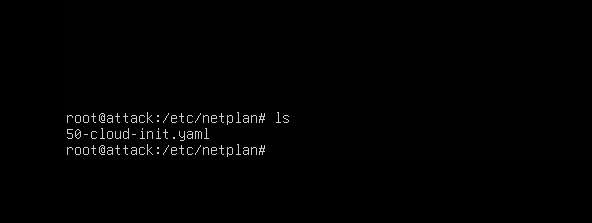\
\
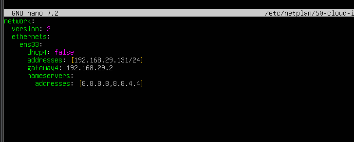\
\
Once that was done, I had to set up LimaCharlie EDR on the Windows VM. This involved creating a new Sensor in my LimaCharlie Organization for my Windows VM and installing the sensor on the VM (my endpoint). Once that was done, I had to configure LimaCharlie to ship the Sysmon event logs to its EDR telemetry by creating an Artifact Collection Rule.\
\
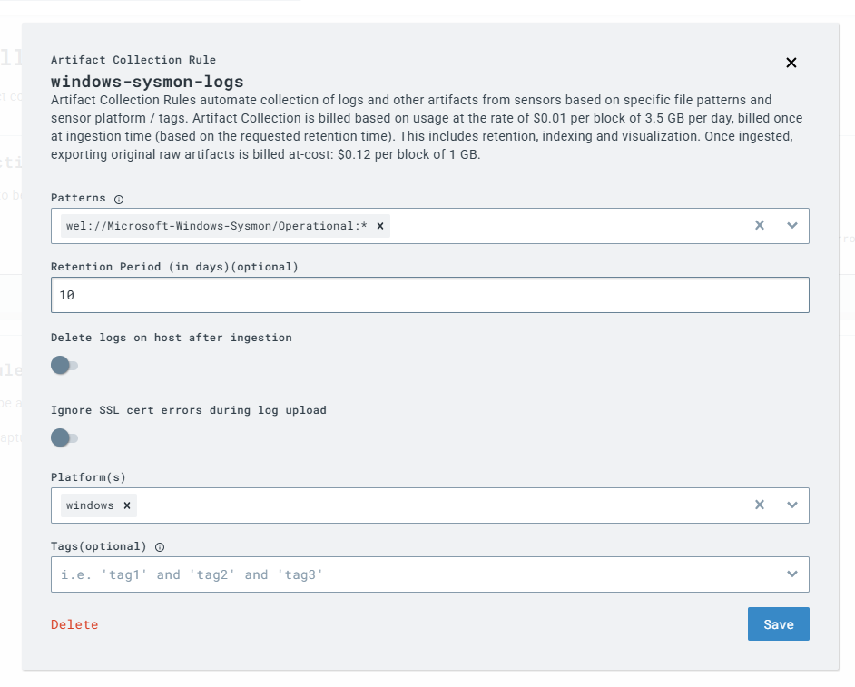\
\
Now that was done, I had to install Sliver, a post-exploitation C2 framework, in my Linux VM. Installing it was as simple as following the instructions in the blog. Then I had to generate a C2 payload within the Sliver application, which was paired with my VM's IP address.

Then, by starting a Python server on my Linux VM, I used it to download the C2 payload onto my Windows VM.
\
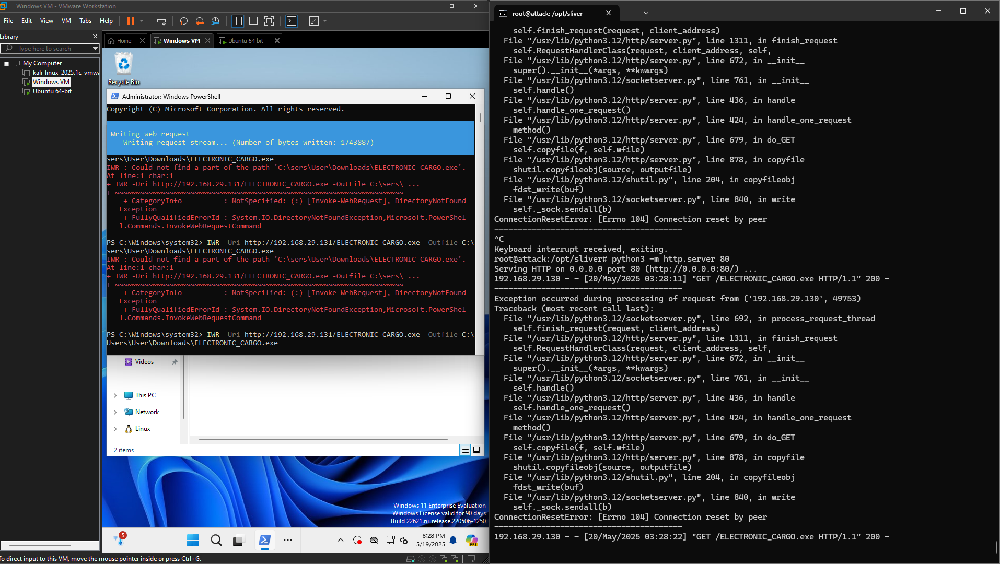

## Starting a C2 Session:
Now that I was all set, I proceeded to start my C2 session by starting an HTTP port on the Sliver Shell, and then all I needed to do was access the payload on my Windows VM.\
\
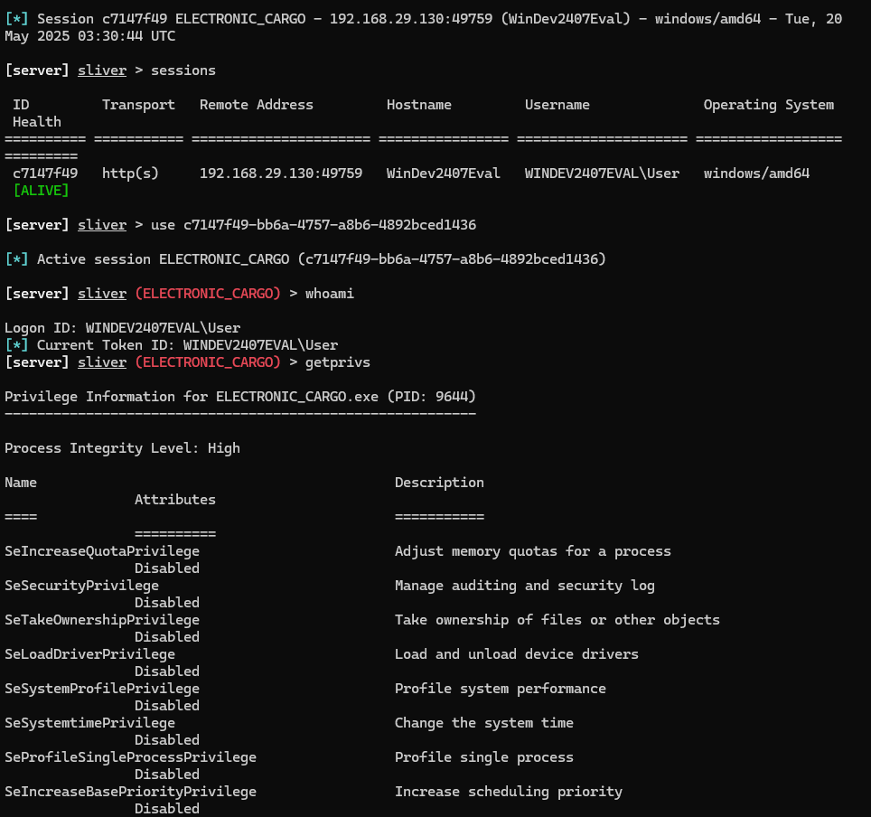
\
\
This started a session, and we could then access this session through the Sliver Shell. I used it to get information about the session, the Windows VM, the privileges that my session had, the working directory, etc.\
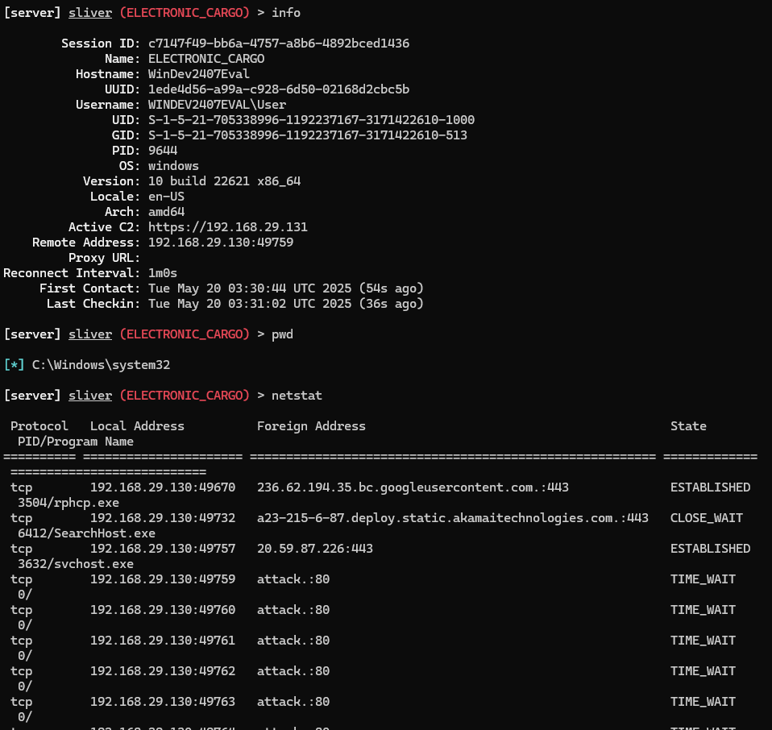\
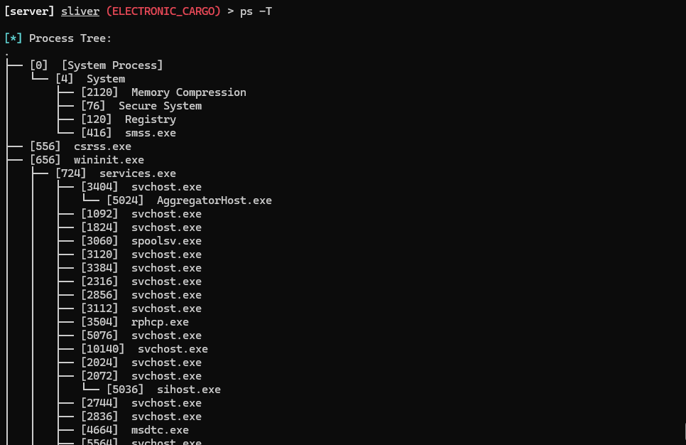\
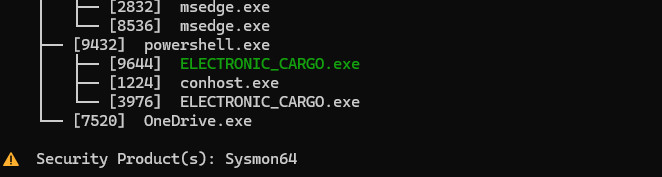\
If we open the Processes section in our LimaCharlie Sensor, we can look for our C2 process using the search bar and find it. We can then see the details, which display the source IP as well as the process ID it is running as.\
\
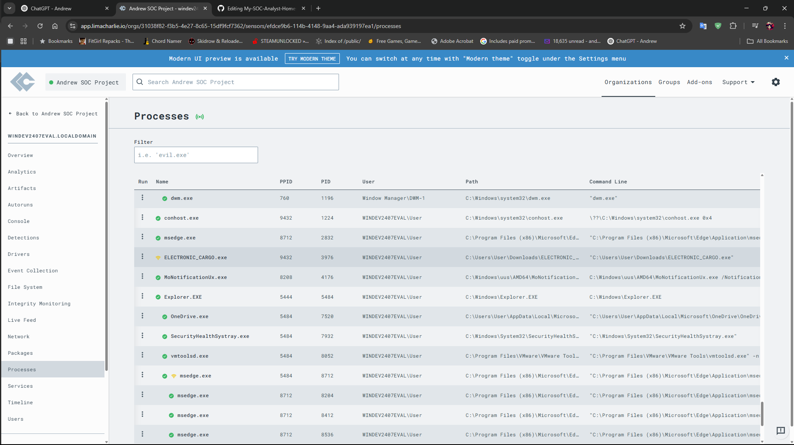

Diving further into the File System section of the sensor, we can find the payload exactly where we downloaded it and check the hash of the executable file with VirusTotal.\
\
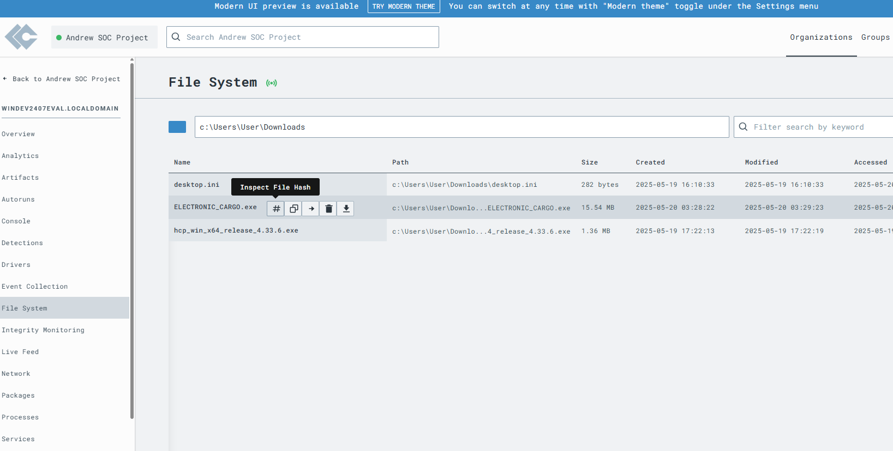\
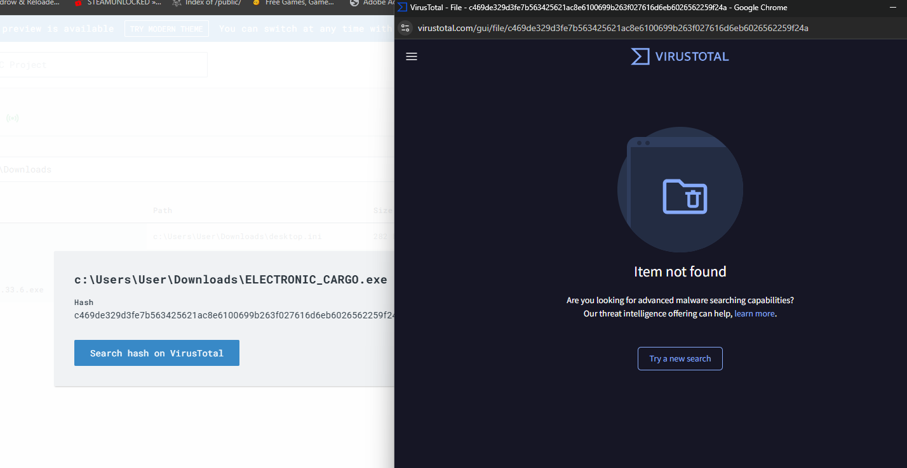

While it says that the hash is not found on VirusTotal, it doesn't mean that the executable is safe. The way it is explained in the blog is: VirusTotal has just never seen the file before, as it compares whether it has ever seen this hash before.

If we go to the Timeline section of the Sensor, we can also see the first time this payload was accessed.
\

Now it was time to attack and view the attack using LimaCharlie.

## The Attack:
I will simulate an attack by attempting credential dumping using LSASS dumping (it will not dump any actual data but will generate event log data for the sensor).\
\
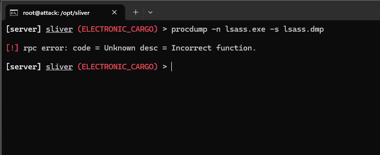\
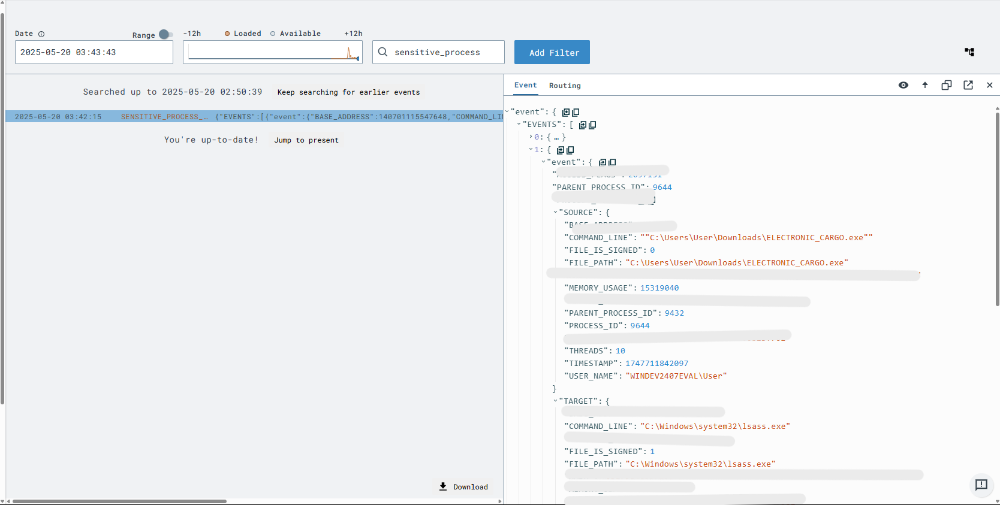\
And sure enough, there is an event that shows the LSASS dumping attempt through the telemetry data in LimaCharlie. I used this event to create a Detection and Response rule that would alert me if any LSASS action was tried again. I tested the rule with the previous event to see if it worked, and sure enough, I was able to create a D&R rule. I called this rule 'LSASS Accessed'.
\
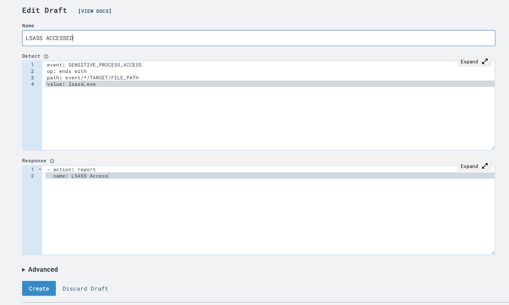\
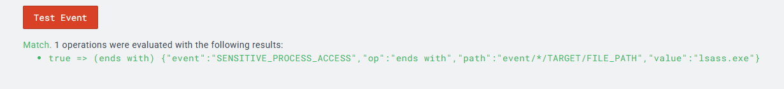\
\
\
Now, when I try the same attack again, we can see the LSASS access attempt in our Detections dashboard.
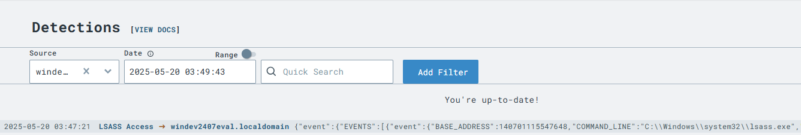\
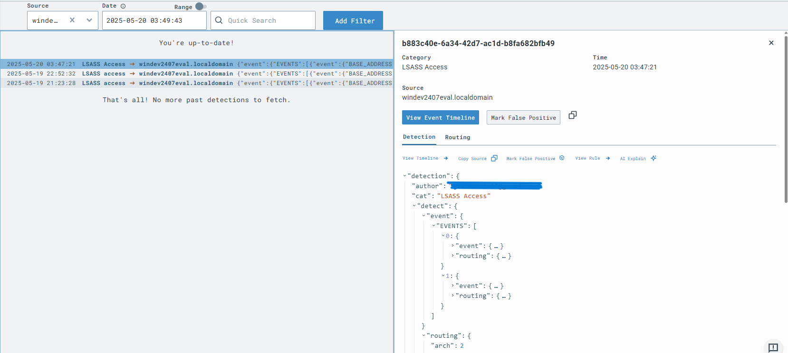

## Conclusion:
This project provided a comprehensive, hands-on introduction to both defensive and offensive cybersecurity practices. By setting up a virtual lab, deploying a Windows and Linux VM, and using tools like LimaCharlie and Sliver, I gained valuable experience in endpoint configuration, threat emulation, and real-time telemetry analysis. Most importantly, I learned how to detect and respond to attacks using LimaCharlie’s EDR capabilities, including building custom Detection & Response rules based on observed malicious behavior. This was a really great SOC Home Lab setup from start to finish.

I thank Eric Capuano in creating this project which really helps a beginner like me to understand a part of what an SOC Analyst does as I dive into field. I also thank Gerald Auger (Simply Cyber YouTube) for the video he made on how to set it up, leading step by step.
